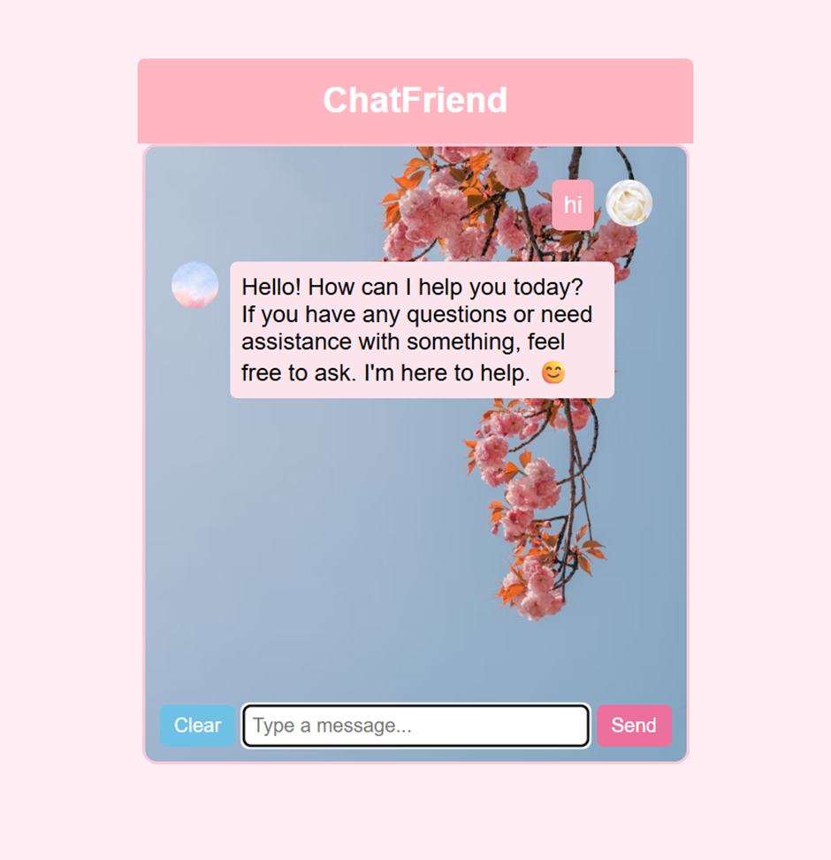

# ChatFriend 🧸💬

**ChatFriend** is a locally running AI chatbot powered by **FastAPI** and **Mistral-7B-Instruct via Ollama**. 
It’s cute, animated, profanity-filtered — and totally free to use (no API keys required)!

---

## ✨ Highlights

- 💬 Local AI chat using Mistral-7B-Instruct (via Ollama)
- 🔒 Built-in profanity filter (`better_profanity`)
- 🎨 Custom HTML/CSS UI with avatars, animations & speech bubbles
- ⚡ Async interaction powered by FastAPI + JS

---

## 🛠 Stack

- Python (FastAPI)
- HTML/CSS/JavaScript
- Ollama + Mistral-7B-Instruct

---

## 📁 Folder Structure

```
ChatFriend/
├── backend/
│   ├── app.py
│   └── requirements.txt
├── frontend/
│   └── index.html
└── README.md
```

---

## 🚀 Getting Started

1. **Set up backend**
   ```bash
   cd backend
   pip install -r requirements.txt
   uvicorn app:app --reload --port 5003
   ```

2. **Run model via Ollama**
   ```bash
   ollama pull mistral:7b-instruct
   ollama run mistral:7b-instruct
   ```

3. **Launch frontend**
   ```bash
   cd frontend
   start index.html
   ```
   Or open `index.html` in your browser directly.

---

## 🖼️ Preview

> 

---

## 👩‍💻 Author

Made with love by **Ishita Pradhan** 🩷  
GitHub: [https://github.com/8Ishita8](https://github.com/8Ishita8)

---

## 📌 Credits

- Mistral Model via [Mistral AI](https://mistral.ai/)
- UI design inspired by nostalgic messenger themes
- Icons & visuals are from Unsplash and used for non-commercial/placeholder use only

---

## 🔒 License

This project is **private**.  
Please **do not copy, clone, or distribute** without explicit permission.

---